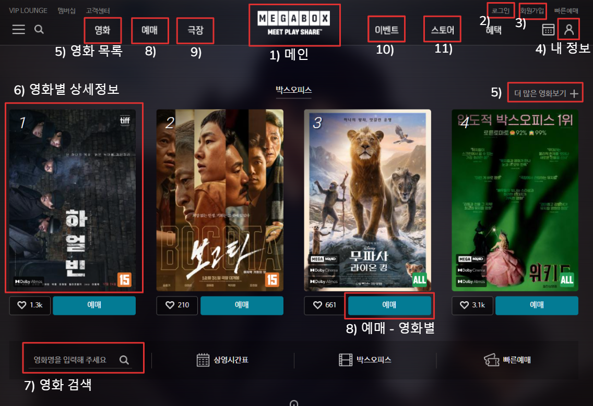

### 2024-12-27
- 사용자 화면 설계
- 메가박스(megabox.co.kr) 모티브 (./tmp_view_image 폴더 참고)

1. 메인 화면

2. 로그인  
   2-1. 아이디 찾기  
   2-2. 비밀번호 찾기  
   2-3. 비회원 예매 확인

3. 회원가입

4. 마이페이지 (회원 등급 - 포인트제)  
   4-1. 예매내역/관람내역 (영화 한정)  
   4-2. 결제내역 (스토어 한정)  
   4-3. 내 리뷰 조회  
   4-4. 쿠폰 조회   
   4-4. 내 정보 변경  
   4-5. 회원 정보 변경 및 탈퇴

5. 전체 영화 목록 (박스오피스 - API)

6. 영화별 상세 정보 / 영화 평점 및 리뷰

7. 영화 검색

8. 예매 (빠른예매 방식으로 고정)  
   8-1. 로그인 없이 예매 시도시 로그인/비회원 예매  
   8-2. 좌석 선택  
   8-3. 좌석 결제 (API)

9. 상영관(극장) 목록   
   9-1. 상영관별 상세 정보 (지도 API)  
   9-2. 상영관별 상영 시간표  
   9-3. 영화 관람료

10. 할인, 이벤트 정보 등 공지사항  
    10-1. 공지사항별 상세 정보

11. 스토어 (스낵, 영화 관련 상품)  
    11-1. 상품별 상세 정보  
    11-2. 상품 결제 (API)

---

## Theme#2 (영화예매 Web Application)

• 영화예매 회원가입/로그인 페이지 구현  
• 대시보드  
• 상영작관리  
• 예매관리  
• 공지사항등  
• 게시판 기능 구현  
• 결제모듈 기능 구현  
• USER/ADMIN별도 관리기능 구현  
• 요구사항 분석  
• 애플리케이션 아키텍처 설계  
• UI/UX개발  
• DBMS연동  
• 외부 Library도입 및 사용  
• 외부 API활용  
• 데이터 입/출력 구현  
• MVC 개발 방식도입
